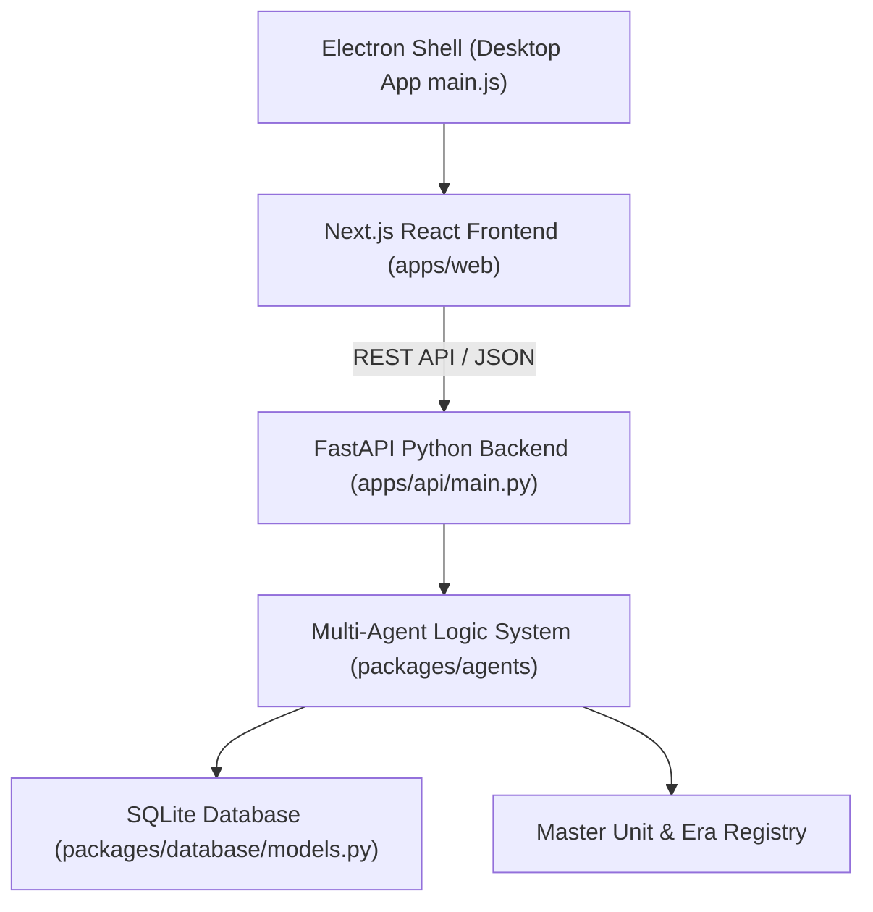

# 🛡️ BT-Manager Alpha v0.1.0 — System Baseline & Architectural Specification

**Publisher:** Lüdinn Entertainment  
**Application Name:** BattleTech Campaign Manager (`BT-Manager`)  
**Version:** `0.1.0-alpha`  
**App ID:** `com.ludinn.btmanager`  
**Git Remote Repository:** [https://github.com/jdickinson9691/BT-Manager.git](https://github.com/jdickinson9691/BT-Manager.git)  

---

## 📖 Executive Summary & Baseline Purpose

This document serves as the **authoritative baseline design specification** for **BT-Manager Alpha v0.1.0**. It documents the complete application architecture, database schemas, API routes, 6-step mercenary campaign lifecycle, Chaos Campaign Warchest economy, tabletop OpFor force setup engine, and rulebook compliance standards. Future tasks, refactoring, and feature extensions in this repository must build upon this established baseline.

---

## 🏛️ 1. Architecture & Technology Stack



1. **Desktop Shell (`main.js`)**: Electron 43.2.0 wrapper hosting static Next.js export and spawning PyInstaller backend process (`extra/main/main.exe`).
2. **Frontend UI (`apps/web/pages/index.js`)**: Next.js 14 + React 18 single-page dashboard designed with a dark-mode cyberpunk glassmorphism aesthetic. Responsive layout, zero horizontal scroll, fixed sticky headers and footers.
3. **Backend API (`apps/api/main.py`)**: Python 3.14 + FastAPI REST API exposing 20+ endpoints for financial ledger, unit management, contract generation, combat AAR, and timeline advancement.
4. **Data Persistence (`packages/database/models.py`)**: SQLAlchemy + SQLite relational database tracking `Campaign`, `Unit`, `Mission`, `Pilot`, `Inventory`, and `Log` models.
5. **Agent Logic Layer (`packages/agents/`)**:
   - `CoreAgent`: Treasury ledger, loan debt management, daily overhead math.
   - `ContractGenerator`: Procedural contract generation, term negotiation, climate heat modifiers, OpFor BV scaling.
   - `MaintenanceAgent`: Armor repair, critical hit component replacement, Tech Bay duration clock.
   - `PersonnelAgent`: A Time of War XP engine, Gunnery/Piloting skill upgrades, MedBay healing duration clock, Bondsmen captive management.
   - `EraFactionAgent`: Historical era unit seeding (2750–3151) and faction-filtered availability.

---

## 💰 2. Economy & Currency Systems (Chaos Campaign Rules)

BT-Manager enforces a strict **Warchest Point (WP)** and **Support Point (SP)** campaign economy per the official Catalyst Game Labs *Chaos Campaign: Total Chaos* and *BattleTech Mercenaries* rulebooks. Zero C-Bill references exist in active campaign play.

- **Warchest Points (WP)**: The primary currency for contract track entry fees, objective payouts, bank loan capital, and bondsmen ransoms.
- **Support Points (SP)**: Secondary logistical currency used for armor repairs (5 SP/point), critical component replacements, and MechLab loadout refits.
- **Currency Exchange Endpoint (`POST /api/v1/finances/convert`)**: Allows 1 WP $\leftrightarrow$ 10 SP currency conversion.
- **Operational Overhead**: Base daily operational overhead ($5,000/day) debited automatically on calendar stardate advance. Monthly staff payroll ($150,000/mo + loan interest) debited on the 1st of every month.

---

## 🗺️ 3. The 6-Step Mercenary Campaign Lifecycle

The main interface is organized into a top 6-step workflow bar guiding mercenary commanders through every contract cycle:

```
[ Step 1: Contract & Transit 📋 ] ➔ [ Step 2: Force Deployment ⚔️ ] ➔ [ Step 3: Combat AAR 🏆 ]
                                                                             │
[ Step 6: Financial Ledger 📊 ] ⬅ [ Step 5: Personnel & MedBay 🏥 ] ⬅ [ Step 4: Tech Bay 🔧 ]
```

### 📋 Step 1: Contract & Transit Logistics
- **MRB Contract Hall**: Browse procedurally generated mercenary contracts from Great Houses, Clans, and independent employers. View planetary climate heat modifiers (Arid +20%, Ice World -10%, Vacuum +1 Heat, Low-G +1 Jump MP) and OpFor threat assessments.
- **Contract Negotiation Suite**: 11-field negotiation modal allowing customization of Base Payout, Salvage Rights (Exchange 25%, Shared 50%, Full 100%), Battle Loss Compensation (BLC 0–100%), and OpFor threat multiplier.
- **JumpNet Starmap Logistics**: Chart JumpShip transit between 9 solar systems (Galax, Tukayyid, Solaris VII, Luthien, Tharkad, Atreus, Sian, New Avalon, Terra), charging $120,000 per jump and advancing campaign date (+7 Days).
- **Tabletop OpFor Setup & BV Parity Audit Modal**:
  - Contextual OpFor Mech & Vehicle Roster pre-populated by Era and Faction.
  - Contextual `ASSIGNED OPFOR MECH` dropdown per pilot with **Self-Contextual Mutual Exclusion** (assigned Mechs are automatically hidden from other pilots).
  - **Special Pilot Ability (SPA) Points Pool**: Displays available contract SPA points pool (`Math.max(4, units * 2)`).
  - **BV2 Parity Audit Meter**: Computes Actual OpFor BV2 taking into account Base Chassis BV2, Gunnery/Piloting Skill Multipliers (*Campaign Operations v5.0*), and SPA perk multipliers (+3% to +5% per SPA). Automatically adjusts contract payout rewards based on actual BV parity ratio.

### ⚔️ Step 2: Force Deployment & Command Lance
- **Command Lance Roster**: Assign active Mechs and MechWarriors to the operational lance. Computes total force tonnage and combined Battle Value 2.0 (BV2).
- **Force Readiness Gauge**: Evaluates damaged units or injured pilots. Displays a prominent **Readiness Alert Modal** offering choice to proceed (*⚠️ Deploy Damaged Force*) or repair (*🔧 Tech Bay Repairs*).
- **DropZone (LZ) Insertion Vectors**: Select insertion vector (*Alpha Plains*, *Bravo Forest +1 Cover/+1 MP*, *Charlie Ridge +1 Range Accuracy*, *Delta Hot Drop +10% Salvage*).

### 🏆 Step 3: Combat AAR, Damage Transfer & Salvage
- **After-Action Report (AAR) Settlement**: Input battle metrics, mission completion status, and narrative combat logs.
- **Automated Mech Damage Transfer**: Enter sustained **Armor Loss**, **Structure Loss**, and **Destroyed Critical Hit Components** (PPC, AC/20, Engine Core, Gyro, Actuators) per Mech. Updates database and populates Step 4 Tech Bay repair cards.
- **Pilot Kill Tracker & XP Engine**: Record enemy Mechs destroyed and captured bondsmen. Earns XP via *A Time of War v4.0* formula:
  $$\text{Earned XP} = 15 \text{ (Base)} + 10\text{--}15 \text{ (Kill Tonnage)} + 15 \text{ (Bondsman Captured)}$$
- **Itemized Salvage Pool**: Claim weapons, heat sinks, armor plates, and scrap cash based on accepted contract salvage clause.

### 🔧 Step 4: Tech Bay, Duration Clock & MechLab
- **Support Points (SP) Repairs**: Restore armor plates (5 SP/point) and internal structure. Replace destroyed critical hit components using warehouse inventory or SP market.
- **Tech Repair Duration Clock Engine**: Calculates labor duration days (*Strategic Operations v5.0*): `1 Day per 20 Armor Points`, `+2 Days for Crit Component`, `+3 Days for Structure`. Repairing advances campaign stardate by exact repair duration.
- **Interactive MechLab Loadout Fitting Engine**: Customize weapon loadouts, heat sinks, and armor specs. Validates tonnage limits, engine rating, internal space, and double heat sink dissipation curves.

### 🏥 Step 5: Personnel, MedBay & Bondsmen Suite
- **MedBay Healing Duration Clock**: Track medical recovery days for injured MechWarriors (7 days per injury point). Administering care advances calendar and restores pilot to `Active` status.
- **Bondsmen Captive Management**: Ransom captured enemy pilots for +50 Warchest Points (WP) or recruit/integrate them into active roster as MechWarriors.
- **Pilot Skill Advancement Engine**: Spend earned combat XP to upgrade **Gunnery rating (-1 for 30 XP)** or **Piloting rating (-1 for 20 XP)** per *A Time of War v4.0*.
- **Special Pilot Abilities (SPAs)**: Assign SPA perks (*Sharpshooter*, *Tactical Genius*, *Royal Marksmanship*, *Trueborn Reflexes*, *Gunslinger*, *Marksman*, *Dodge*, *Iron Will*) and recruit candidates from the Hiring Hall.

### 📊 Step 6: Financial Ledger & Debt Suite
- **Treasury Ledger Audit**: View liquid Warchest WP, Support Points (SP), base daily overhead ($5,000/day), and MRB Rating standing (F to A*).
- **ComStar & MRB Financial Credit Facilities**: Take out capital credit lines ($1,000,000 @ 5.0%/mo or $5,000,000 @ 7.5%/mo) and repay principal debt from treasury funds.
- **Timeline Stardate Advance**: Advance calendar with `📅 +1 Day` or `⏩ +7 Days` buttons. Automatically debits operational overhead and 1st-of-the-month staff payroll ($150,000/mo + loan interest).

---

## 🛸 4. Campaign Launcher Wizard (2-Step Sequence)

The Campaign Launcher enforces a strict, thematic 2-step setup workflow:

1. **Step 1: Campaign Logistics & Era**:
   - Campaign Name $\rightarrow$ Select Era (2750, 2821, 3025, 3050, 3062, 3068, 3151) $\rightarrow$ Select Player Faction (dynamically filtered by era) $\rightarrow$ Mercenary Company Name $\rightarrow$ Commander Name $\rightarrow$ Next.
2. **Step 2: Configure Roster & Pilots**:
   - Pre-populates 4 era-accurate starting Mechs from `MasterUnitDatabase`.
   - Pre-populates matching pilot count 1:1 with starting Mechs.
   - Contextual `ASSIGNED MECH (ROSTER)` dropdown per pilot with mutual exclusion logic.
   - Default pilot skill ratings initialized to **Gunnery 4 / Piloting 5**.

---

## 📜 5. Intellectual Property (IP) & Publisher Compliance

- **Publisher Name**: Lüdinn Entertainment
- **Legal Trademark Disclaimer**:
  > *"BattleTech, MechWarrior, and associated logos, faction emblems, and unit names are registered trademarks of Topps Company, Inc. and Catalyst Game Labs. BT-Manager is an open-source, non-commercial tabletop companion tool created by Lüdinn Entertainment for fan utility and campaign management."*
- **Operations Manual Modal**: Features a zero-scroll 3-tier container with a fixed sticky footer (`✓ Close Manual`) and a dedicated **`📚 References & IP Attribution`** section listing 12+ public source materials, download URLs, and copyright owners.

---

## 🧪 6. Test Suite & Verification (18/18 Pass Rate)

Automated test harness `tests/test_harness.py`:
- `test_01_core_agent_ledger_summary`
- `test_02_generate_procedural_and_custom_contracts`
- `test_03_contract_generator_official_rules`
- `test_04_combat_aar_kill_tracker_and_xp_engine`
- `test_05_maintenance_repair_and_inventory`
- `test_06_personnel_xp_skill_upgrades`
- `test_07_data_sync_agent_network_toggles`
- `test_08_force_deployment_and_dropzone_selection`
- `test_09_aar_damage_transfer_to_tech_bay`
- `test_10_tech_repair_time_duration_clock`
- `test_11_bondsmen_ransom_and_integration`
- `test_12_comstar_bank_loan_financing`
- `test_13_contract_negotiation_and_opfor_enemy_bv`
- `test_14_era_historical_data_registry_seeding`
- `test_15_custom_roster_and_pilot_campaign_creation`
- `test_16_opfor_roster_generation_and_aar_salvage_bondsmen_link`
- `test_17_opfor_bv_reward_adjustment_and_faction_units`
- `test_18_wp_sp_currency_conversion`

---

## 📦 7. Release Artifacts

- **Installer Path**: [D:\Ludinn\Development\BT-Manager\dist\BT-Manager Setup 0.1.0-alpha.exe](file:///D:/Ludinn\Development\BT-Manager\dist\BT-Manager%20Setup%200.1.0-alpha.exe)
- **Main Executable**: [D:\Ludinn\Development\BT-Manager\dist\main\main.exe](file:///D:/Ludinn\Development\BT-Manager\dist\main\main.exe)
- **Web Export**: `D:\Ludinn\Development\BT-Manager\apps\web\out\index.html`
